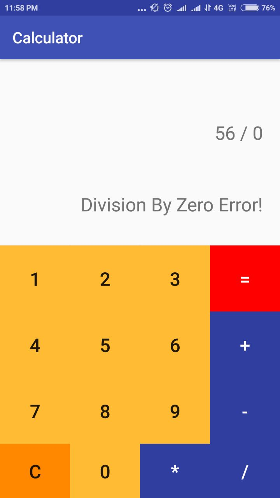

# MyAndroidProjects

## Calculator App:
Very basic calculator which can do following four operations:
<ol>
  <li>Summation</li>
  <li>Subtraction</li>
  <li>Division</li>
  <li>Multiplication</li>
</ol>

<h3> Extra features: </h3>
User can erase the content using <b>C</b> button provided in the app. 
User can use the latest result to perform further calculations.

<h3> Limitations: </h3>
Only integer calculations are possible in this app.

<h3> Screenshots: </h3>

